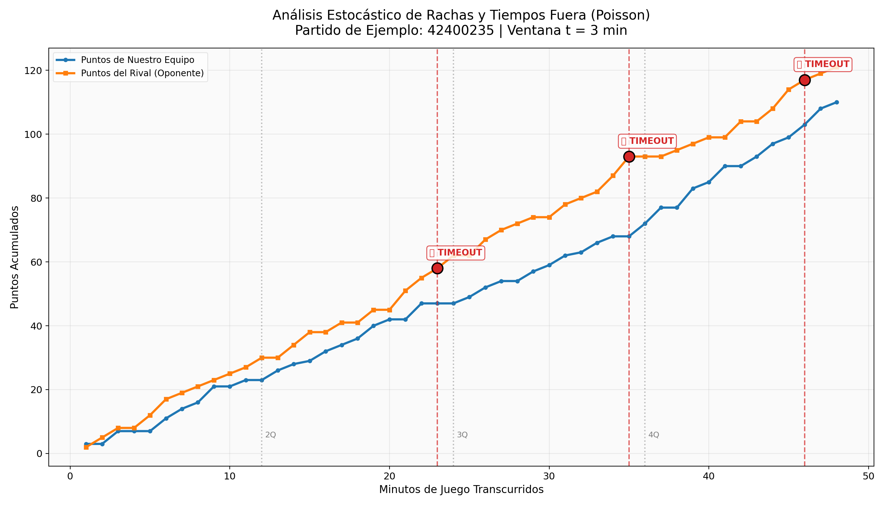

# NBA-Poisson-TimeOut: Sistema Estocástico de Detección de Rachas y Optimización de Tiempos Fuera 🏀📈

Un framework modular en Python diseñado para auditar la dinámica de juego en la NBA en tiempo real. Utiliza la teoría de **Procesos Estocásticos de Poisson** aplicados a datos jugada a jugada (*Play-by-Play*) para identificar rachas de anotación del rival estadísticamente improbables y recomendar de forma óptima el momento exacto para pedir un tiempo fuera (*Timeout*) para "romper el momentum".

---

## 📌 1. Descripción del Proyecto y Contexto de Negocio

En el baloncesto profesional, en particular en la NBA, el **"momentum"** o racha de anotación es un factor psicológico y táctico crítico. Un equipo que entra en una racha anotadora (e.g., un parcial de 10-0 en 2 minutos) no solo acumula una ventaja en el marcador, sino que altera la confianza de los jugadores y la dinámica táctica del juego. 

Tradicionalmente, los entrenadores (*coaches*) piden tiempos fuera basándose en su intuición o cuando la racha ya ha causado un daño irreversible en el marcador. **NBA-Poisson-TimeOut** resuelve este problema mediante un enfoque cuantitativo riguroso:
*   **Problema**: La toma de decisiones subjetiva e tardía al solicitar tiempos fuera.
*   **Solución**: Modelar las anotaciones del rival como un **Proceso de Poisson Homogéneo** (el cual representa la hipótesis nula de flujo normal y constante de anotación). Cuando el número de puntos recibidos en una ventana móvil de $t$ minutos es sumamente improbable bajo esta hipótesis (p-valor $< 0.05$), el sistema detona una señal de alerta técnica (`🔥 TIMEOUT`) para enfriar el partido y reorganizar la estrategia defensiva.

---

## 🧮 2. Fundamento Matemático y Modelado Estocástico

### A. El Proceso de Poisson para Anotaciones Deportivas
Asumimos que el número de puntos que anota el oponente a lo largo del partido se comporta como un proceso de conteo estocástico continuo $\{N(t), t \ge 0\}$. Bajo la hipótesis nula ($H_0$), las anotaciones siguen un **Proceso de Poisson Homogéneo** con una tasa media constante de intensidad $\lambda$ (puntos concedidos por minuto) calculada de forma empírica a partir del histórico de la temporada actual:

$$\lambda = \frac{\text{Total de Puntos Recibidos en la Temporada}}{\text{Total de Minutos Jugados (Partidos} \times 48\text{ min)}}$$

Para una ventana de tiempo móvil de tamaño $t$ (minutos), la variable aleatoria $X$, que representa los puntos anotados por el oponente en ese intervalo, sigue una distribución de Poisson:
$$X \sim \text{Poisson}(\lambda_t) \quad \text{donde} \quad \lambda_t = \lambda \cdot t$$

La función de masa de probabilidad (PMF) para recibir exactamente $y$ puntos en un intervalo $t$ es:
$$P(X = y) = \frac{e^{-\lambda_t} \lambda_t^y}{y!}$$

### B. Análisis de Equidispersión y Selección de la Ventana Óptima ($t$)
Bajo la distribución de Poisson, se cumple la propiedad de equidispersión: $E[X] = \text{Var}[X] = \lambda_t$. Para validar la consistencia del modelo y seleccionar la ventana óptima $t$, se calcula el **Índice de Dispersión de Fisher** ($D$):

$$D = \frac{\text{Var}[X]}{E[X]}$$

*   **$t = 2$ minutos ($D \approx 1.03 > 1$)**: Presenta **sobredispersión**. A escalas muy cortas de juego, las fluctuaciones aleatorias (ruido de alta frecuencia, e.g., dos triples consecutivos) inflan artificialmente la varianza, lo que generaría falsos positivos si se usa para decidir tiempos fuera.
*   **$t = 3$ minutos ($D \approx 0.94 \approx 1$)**: Representa el **punto de equilibrio óptimo**. El índice está sumamente cercano a 1, lo que valida que el proceso se comporta de manera estrictamente Poissoniana en esta escala, filtrando el ruido corto pero reaccionando a tiempo.
*   **$t \ge 5$ minutos ($D \approx 0.78 < 1$)**: Presenta **subdispersión**. A escalas largas, las anotaciones convergen a su media histórica (debido al carácter estacionario y los límites físicos del juego). Deportivamente, esperar 5 minutos para detectar una racha es **tácticamente inútil**, pues el oponente ya habrá consolidado su ventaja.

### C. Lógica de Decisión del Timeout (p-valor)
Si el rival anota $k$ puntos en una ventana de $t=3$ minutos finalizando en el minuto $m$, calculamos la probabilidad acumulada de la cola derecha (la probabilidad de observar una racha de $k$ o más puntos bajo condiciones normales de juego):

$$p\text{-valor} = P(X \ge k) = 1 - P(X \le k - 1) = 1 - \sum_{i=0}^{k-1} \frac{e^{-\lambda_t} \lambda_t^i}{i!}$$

Fijamos un nivel de significancia de **$\alpha = 0.05$**. Si:
$$p\text{-valor} < 0.05$$
Rechazamos $H_0$ (concluimos que la racha del oponente no es una fluctuación aleatoria común, sino un evento anómalo de alto rendimiento) y el algoritmo genera la señal de **`🔥 TIMEOUT`**.

Para acoplarse a las restricciones reales del deporte, se incorpora un **cooldown técnico** de 4 minutos. Si se sugiere un tiempo fuera en el minuto $m$, no se podrá sugerir otro antes del minuto $m + 4$, evitando así la saturación de alertas en ventanas solapadas.

---

## 🏗️ 3. Arquitectura del Pipeline y Módulos

El proyecto está diseñado bajo una arquitectura modular limpia, lo que facilita el mantenimiento, la reproducibilidad y el escalado de datos:

```
proyecto_estocasticos_nba/
├── main.py                 # Orquestador y punto de entrada del pipeline
├── requirements.txt        # Dependencias del sistema
├── src/
│   ├── extract.py          # Extracción y rate limiting con nba_api (PBP V3)
│   ├── clean.py            # Parseo de tiempo ISO-8601 y estructuración temporal
│   └── analysis.py         # Lógica estocástica de Poisson y motor gráfico
├── data/
│   ├── raw/                # Archivos CSV crudos descargados de la API
│   └── processed/          # Series temporales limpias por minuto y resumen final
└── plots/
    └── timeout_analysis.png # Visualización premium de los tiempos fuera
```

*   **`main.py`**: El orquestador central que secuencia la ejecución de las fases, acepta argumentos por consola (e.g., cambiar de equipo o número de partidos) y administra la persistencia de las métricas clave.
*   **`src/extract.py`**: Implementa la descarga de datos desde `nba_api` utilizando el endpoint moderno `PlayByPlayV3` (necesario para la temporada 2024-25). Cuenta con un sistema adaptativo de **exponential backoff** para mitigar bloqueos por Rate Limit.
*   **`src/clean.py`**: Transforma la línea de tiempo irregular del play-by-play en una serie temporal uniforme de intervalos regulares de 1 minuto (1 a 48+). Traduce el reloj ISO-8601 (`PTMMMSS.00S`) a minutos transcurridos continuos y mapea la localía del equipo a partir del `MATCHUP`.
*   **`src/analysis.py`**: Realiza los cálculos matemáticos de Poisson. Analiza la variabilidad de las ventanas temporales, ejecuta el algoritmo de timeouts con cooldown e implementa la visualización gráfica premium en `matplotlib`.

---

## 🚀 4. Instalación y Uso

### Requisitos Previos
*   Python 3.10 o superior instalado.
*   Conexión a internet (para la primera extracción de datos de NBA.com).

### Instalación de Dependencias
Clona el repositorio e instala los paquetes requeridos usando:
```bash
pip install -r requirements.txt
```

### Modos de Ejecución

1.  **Ejecución Completa (Descarga y Procesa)**:
    Descarga los datos jugada a jugada para los últimos 5 partidos de los *Golden State Warriors* de la temporada 24-25 y ejecuta el modelado:
    ```bash
    python main.py --team warriors --limit-games 5
    ```

2.  **Ejecución Rápida Local (Omitiendo la API)**:
    Si ya has descargado los datos en `data/raw/` y solo deseas ajustar parámetros o regenerar los gráficos de forma instantánea:
    ```bash
    python main.py --skip-extract
    ```

3.  **Ejecución para otros equipos admitidos**:
    El sistema soporta equipos clave configurados mediante su ID oficial de la NBA:
    ```bash
    python main.py --team lakers --limit-games 3
    ```
    *Equipos soportados por defecto: `warriors`, `lakers`, `celtics`, `bulls`, `heat`, `spurs`, `nuggets`, `bucks`.*

---

## 📊 5. Interpretación de Resultados

Al finalizar el pipeline, el programa genera dos salidas principales de alto valor analítico:

### A. Reporte CSV Consolidado (`data/processed/[equipo]_resumen_timeouts.csv`)
Conserva un registro estructurado con el resumen global de la auditoría estocástica para los partidos evaluados:
*   `lambda_minuto_base`: Tasa histórica de puntos recibidos por minuto.
*   `partido_showcase`: ID del partido seleccionado dinámicamente para la visualización.
*   `timeouts_sugeridos`: Total de solicitudes detonadas por el algoritmo en el partido.
*   `max_racha_rival`: La racha máxima de puntos anotada por el rival en cualquier ventana de 3 minutos.

### B. Visualización Gráfica (`plots/timeout_analysis.png`)
Esta gráfica premium representa la evolución temporal del partido y los hitos del modelo estocástico:



**Cómo leer la gráfica:**
1.  **Curva Azul (Nuestro Equipo)** vs **Curva Naranja (Oponente)**: Representan la acumulación total de puntos a lo largo de los 48 minutos de juego regular.
2.  **Líneas Verticales Rojas Punteadas**: Indican el minuto exacto donde la pendiente de la curva del rival incrementó de forma anómala (racha), superando el umbral de significancia.
3.  **Indicadores `🔥 TIMEOUT`**: Ubicados en los momentos donde el p-valor de Poisson cayó por debajo de $0.05$. El entrenador debió solicitar el tiempo fuera en ese preciso instante para neutralizar tácticamente el momentum defensivo antes de que el marcador se distanciara.
4.  **Divisores Punteados Grises**: Marcan el fin de cada cuarto (12 min, 24 min, 36 min), permitiendo contextualizar el momento del partido (e.g., cierres de cuarto o momentos clutch en el último periodo).

---

## 🛠️ 6. Auditoría de Ingeniería y Control de Calidad

El sistema ha sido auditado de acuerdo con los más rigurosos estándares de la ingeniería de datos:
1.  **Consistencia de Tiempos Lógicos**: El parseador traduce con precisión el reloj ISO-8601 del baloncesto al tiempo neto de juego continuo. El agrupamiento temporal (*minute binning*) con interpolación hacia adelante (*forward fill*) garantiza que no haya saltos vacíos en el proceso estocástico durante pausas de juego real.
2.  **Rigor de Probabilidad Discreta**: Para calcular la probabilidad acumulada de la cola derecha de una variable discreta, se aplica estrictamente $P(X \ge k) = 1 - \text{cdf}(k - 1)$. Esto previene el error clásico de frontera de subestimar el p-valor al incluir incorrectamente el punto crítico en la distribución acumulada.
3.  **Prevención de Bloqueos de API**: La integración de reintentos con retraso exponencial adaptativo (*exponential backoff*) y sleep adaptativo permite la descarga masiva sin disparar los limitadores de tráfico de los servidores de la NBA.
